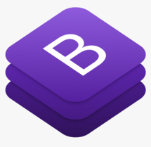
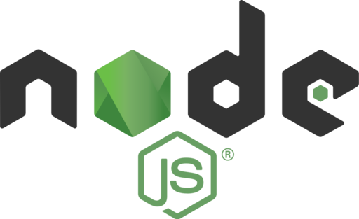
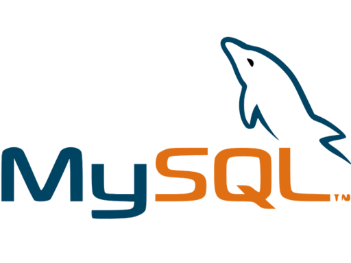

<h1 style="text-align: center;"
 >Welcome to Groupomania 👋</h1>


> Réseau social d'entreprise

## Stack technique

* **Frontend** : Application VueJS & Framework Bootstrap.

<div style="display: flex;flex-direction: row;">
  
  
</div>

* **Backend** : NodeJS, Application Express, Typescript & Passport Auth.

<div style="display: flex;flex-direction: row;">
    
    
    
    
</div>

* **Database** : mySQL générée par Sequelize ORM au niveau du backend.

<div style="display: flex;flex-direction: row;">
    
    
</div>

## Compétences évaluées

* Personnaliser le contenu envoyé à un client web
* Gérer un stockage de données à l'aide de SQL
* Implémenter un stockage de données sécurisé en utilisant SQL
* Authentifier un utilisateur et maintenir sa session

## Spécifications thechniques

* <a href="./docs/Groupomania_Specs_FR_DWJ_VF.pdf" target="_blank">guidelines.pdf</a>

### 🏠 [Homepage](https://github.com/VGMSoft/VirgileGuglielmi_7_26062021)

***

## Frontend

* Setup
    ```sh
  # Run Vue3 & launch frontend server
  cd ./frontend/
  npm run serve
  ```

## Database

* Setup
    ```sh
  # 1 - Connect to your local SQL server
  # 2 - Create groupomania database ( ⚠️️ may scratch existing data )
  mysql> SOURCE ./backend/models/SQL/setup.sql;
  # 3 - Run backend (cf: Backend section )
  # 4 - Create admin profile
  mysql> SOURCE ./backend/models/SQL/admin.sql;
  ```
⚠️ setup.sql allows you to scratch and reinit Database
## Backend

* Setup

  ```sh
  # Run server.ts & launch backend server
  cd ./backend/
  npm run dev
  ```

* API Routes

 : Already avaible
<br/>
 : Not yet avaible

|Verb|Setting|Body|Response type|Function
|:---:|---|---|---|---|
|**<span style="color: gold;">Auth</span>**| | | | |
||/api/auth/signup|{ email: string, password:string }|{ message: string }|Crypte l'email et hash le mot de passe de l'utilisateur, ajoute le nouvel utilisateur à la base de données|
||/api/auth/login|{ email: string, password: string }|{ userId: string, token: string }|Vérifie les informations d'identification de l'utilisateur, en renvoyant l'identifiant userID depuis la base de données et un jeton Web JSON signé( contenant également l'identifiant userID )
|**<span style="color: gold;">Profile</span>**| | | | |
||api/profile|_|Objet de profil|Renvoie l'objet représentant les données de l'utilisateur|
||api/profile|_|Objet de profil|Modifie les données du profil en base de données|
||api/profile|_|{ message: String }|Supprime le compte utilisateur ainsi que ses données, ses posts et ses commentaires.|
||api/profile/avatar| { image: File }|{ message: String }|Upload une photo de profil.|
||api/profile/avatar|{ image: File }|{ message: String }|Update la photo de profil.|
|**<span style="color: gold;">Posts</span>**| | | | |
||/api/post|_|Tableau des posts|Créé une publication et l'enregistre dans la base de données|
||/api/post|_|Post unique|Renvoie le tableau de tous les posts dans la base de données|
||/api/post/:id|{ post: String, image: File }|{ message: String }|Renvoie le post avec l'ID fourni|
||/api/post/:id|-|-|Modifie le post|
||/api/post/:id|-|-|Supprime le post|
|**<span style="color: gold;">Comments</span>**| | | | |
||api/posts/id/comments|-|-|Créé une commentaire pour une publication donnée.|
||api/posts/id/comments|-|-|Renvoie tous les commentaires pour une publication donnée.|
||api/posts/id/comments/id|-|-|Renvoie le commentaires correspondant à l' ID fourni pour une publication donnée.|
||api/posts/id/comments/id|-|-|Modifie le commentaires correspondant à l' ID fourni pour une publication donnée.|
|**<span style="color: gold;">Likes</span>**| | | | |
||/api/like|-|-|Récupère les likes d'un post et son auteur|
||/api/like|-|-|Renvoie la sauce avec l'ID fourni|
||/api/like|-|-|Modifie le statut d'un like.|


***

## Author

👤 **Virgile Guglielmi**

* **Twitter** : [@virgilegug](https://twitter.com/virgilegug)
* **Github** : [@VGMSoft](https://github.com/VGMSoft)

## Show your support

Give a ⭐️ if this documentation helped you!

***
_This README was generated️ by [readme-md-generator](https://github.com/kefranabg/readme-md-generator)_