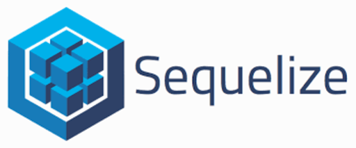

<h1 align="center">Welcome to Groupomania 👋</h1>

  

> Réseau social d'entreprise

## Stack technique

* **Frontend** : Application VueJS.
* **Backend** : Application Express & Typescript.
* **Database** : mySQL générée par Sequelize ORM au niveau du backend.

    
    
    
    
    

  

## Compétences évaluées

* Personnaliser le contenu envoyé à un client web
* Gérer un stockage de données à l'aide de SQL
* Implémenter un stockage de données sécurisé en utilisant SQL
* Authentifier un utilisateur et maintenir sa session

## Spécifications thechniques

* <a href="./docs/Groupomania_Specs_FR_DWJ_VF.pdf" target="_blank">guidelines.pdf</a>

### 🏠 [Homepage](https://github.com/VGMSoft/VirgileGuglielmi_7_26062021)

***

## Frontend

## Backend

Coming soon !!

|Verb|Setting|Body|Response type|Function
|---|---|---|---|---|
||/api/auth/signup|{ email: string, password:string }|{ message: string }|Crypte l'email et hash le mot de passe de l'utilisateur, ajoute le nouvel utilisateur à la base de données|
||/api/auth/login|{ email: string, password: string }|{ userId: string, token: string }|Vérifie les informations d'identification de l'utilisateur, en renvoyant l'identifiant userID depuis la base de données et un jeton Web JSON signé( contenant également l'identifiant userID )
||/api/auth/logout|?|?|Déconnecte l'utilisateur
|**Posts**|---|---|---|---|
||/api/post|_|Tableau des posts|Renvoie le tableau de tous les posts dans la base de données|
||/api/post/:id|_|Post unique|Renvoie le post avec l'ID fourni|
||/api/post|{ post: String, image: File }|{ message: String }|Capture et enregistre l'image, analyse la sauce en utilisant une chaîne de caractères et l'enregistre dans la base de données, en définissant correctement son image URL. Remet les sauces aimées et cellesdétestées à 0, et les sauces usersliked et celles usersdisliked aux tableaux vides.|
||/api/post/:id| Post.json() ou { sauce:String, image: File }|{ message: String }|Met à jour le post avec l'identifiant fourni. Si une image est téléchargée, capturez-la et mettez à jour l'image URL du post. Si aucun fichier n'est fourni, les détails de la sauce figurent directement dans le corps de la demande(req.body.name, req.body.heat etc). Si un fichier est fourni, la sauce avec chaîne est en req.body.sauce.|
||/api/post/:id|_|{ message: Chaîne }|Supprime la sauce avec l'ID fourni.|
||/api/post/:id/like|{ userId: Chaîne, j'aime :Nombre }|{ message: Chaîne }|Définit le statut "j'aime" pour userID fourni. Si j'aime = 1, l'utilisateur aime la sauce. Si j'aime = 0, l'utilisateur annule ce qu'il aime ou ce qu'il n'aime pas. Si j'aime = -1, l'utilisateur n'aime pas la sauce. L'identifiant de l'utilisateur doit être ajouté ou supprimé du tableau approprié, en gardant une trace de ses préférences et en l'empêchant d'aimer ou de ne pas aimer la même sauce plusieurs fois. Nombre total de "j'aime" et de "je n'aime pas" à mettre à jour avec chaque "j'aime".|
|**Comments**|---|---|---|---|
||/api/post|_|Tableau des sauces|Renvoie le tableau de tous les posts dans la base de données|
||/api/post/:id|_|Sauce unique|Renvoie la sauce avec l'ID fourni|
||/api/post|{ sauce: Chaîne, image: Fichier }|{ message: Chaîne }|Capture et enregistre l'image, analyse la sauce en utilisant une chaîne de caractères et l'enregistre dans la base de données, en définissant correctement son image URL. Remet les sauces aimées et cellesdétestées à 0, et les sauces usersliked et celles usersdisliked aux tableaux vides.|
||/api/post/:id|SOIT Sauce comme JSON OU { sauce:Chaîne, image: Fichier }|{ message: Chaîne }|Met à jour la sauce avec l'identifiant fourni. Si une image est téléchargée, capturez-la et mettez à jour l'image URL des sauces. Si aucun fichier n'est fourni, les détails de la sauce figurent directement dans le corps de la demande(req.body.name, req.body.heat etc). Si un fichier est fourni, la sauce avec chaîne est en req.body.sauce.|
||/api/post/:id|_|{ message: Chaîne }|Supprime la sauce avec l'ID fourni.|
||/api/post/:id/like|{ userId: Chaîne, j'aime :Nombre }|{ message: Chaîne }|Définit le statut "j'aime" pour userID fourni. Si j'aime = 1, l'utilisateur aime la sauce. Si j'aime = 0, l'utilisateur annule ce qu'il aime ou ce qu'il n'aime pas. Si j'aime = -1, l'utilisateur n'aime pas la sauce. L'identifiant de l'utilisateur doit être ajouté ou supprimé du tableau approprié, en gardant une trace de ses préférences et en l'empêchant d'aimer ou de ne pas aimer la même sauce plusieurs fois. Nombre total de "j'aime" et de "je n'aime pas" à mettre à jour avec chaque "j'aime".|
|**Likes**|---|---|---|---|
||/api/post|_|Tableau des sauces|Renvoie le tableau de tous les posts dans la base de données|
||/api/post/:id|_|Sauce unique|Renvoie la sauce avec l'ID fourni|
||/api/post|{ sauce: Chaîne, image: Fichier }|{ message: Chaîne }|Capture et enregistre l'image, analyse la sauce en utilisant une chaîne de caractères et l'enregistre dans la base de données, en définissant correctement son image URL. Remet les sauces aimées et cellesdétestées à 0, et les sauces usersliked et celles usersdisliked aux tableaux vides.|

## Database

***

## Author

👤 **Virgile Guglielmi**

* **Twitter** : [@virgilegug](https://twitter.com/virgilegug)
* **Github** : [@VGMSoft](https://github.com/VGMSoft)

## Show your support

Give a ⭐️ if this documentation helped you!

***
_This README was generated️ by [readme-md-generator](https://github.com/kefranabg/readme-md-generator)_